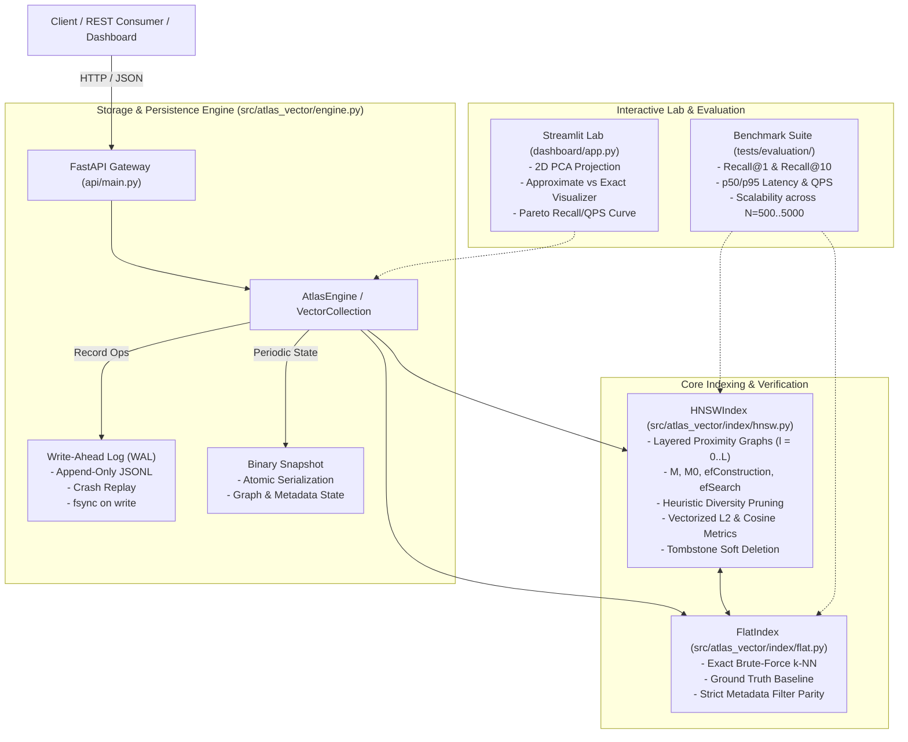

# Atlas Vector — HNSW ANN Search Engine & Benchmark Lab

[](https://github.com/)
[](https://www.python.org/)
[](https://fastapi.tiangolo.com/)
[](https://github.com/astral-sh/ruff)
[](LICENSE)

An **educational, reproducible Hierarchical Navigable Small World (HNSW)** approximate nearest neighbor (ANN) search engine and benchmark laboratory built from first principles in pure Python and NumPy. Features append-only Write-Ahead Logging (WAL) for durability, atomic binary snapshots, exact brute-force ground-truth baseline comparison, and a Streamlit interactive visualizer with 2D PCA projection.

---

> [!IMPORTANT]
> ### Educational Positioning & Disclaimer: Not a Production Vector Database
> **Atlas Vector is built as an educational and reproducible reference implementation**, designed to explore, benchmark, and teach the internal mechanics of layered graph indexing, heuristic neighbor diversity pruning, and crash recovery.
>
> - **Not a replacement for production vector databases**: It is **not** an alternative to Pinecone, Milvus, Qdrant, or FAISS.
> - **In-Memory Graph Topology**: Graph adjacency sets and vectors reside in Python memory. While suitable for experimental and educational datasets ($N \le 50,000$), large-scale workloads require native compiled engines (C++/Rust) with SIMD acceleration and disk-backed quantization (PQ/IVF).
> - **Reproducible Benchmark Transparency**: All reported recall, latency, and throughput metrics are measured from direct benchmark script executions (`tests/evaluation/run_benchmark.py`) under fixed random seeds, not theoretical or marketing estimates.

---

## Architectural Overview

Atlas Vector separates concerns across indexing, exact verification, persistence, REST interfaces, and visualization:



---

## Algorithmic Foundations of HNSW

Hierarchical Navigable Small World (Malkov & Yashunin, 2018) solves the curse of dimensionality by organizing data points into a multi-layer graph hierarchy where:
1. **Higher Layers ($l > 0$)**: Feature longer-distance skip connections with sparse density for fast logarithmic greedy routing towards the nearest cluster entry point.
2. **Bottom Layer ($l = 0$)**: Contains all vectors connected via dense short-range edges to provide fine-grained nearest neighbor resolution.

### 1. Level Assignment
A node's maximum layer level $l$ is sampled from an exponential distribution with normalization factor $m_L = 1 / \ln(M)$:

$$l = \lfloor -\ln(\text{uniform}(0, 1)) \cdot m_L \rfloor$$

### 2. Layer Search (`SEARCH-LAYER`)
Traverses a specific layer using dynamic candidate heaps:
- A min-heap $C$ tracks candidate nodes to visit, ordered by distance ascending.
- A max-heap $W$ tracks the $ef$ best discovered neighbors, ordered by distance descending.
- Traversal halts when the closest candidate in $C$ is further than the furthest neighbor in $W$.

### 3. Heuristic Neighbor Selection with Diversity Pruning
Standard simple neighbor selection connects only the absolute nearest nodes, causing dense clustering. Atlas Vector implements Algorithm 4 (`SELECT-NEIGHBORS-HEURISTIC`):
- A candidate $e$ is connected to base vector $q$ only if $e$ is closer to $q$ than to any already chosen neighbor $r \in R$:

$$\text{dist}(e, q) < \text{dist}(e, r) \quad \forall r \in R$$

This forces links to span different directional quadrants, ensuring navigable small-world properties.

---

## Quantitative Benchmark Results

The benchmark suite (`tests/evaluation/run_benchmark.py`) runs reproducible evaluations against exact brute-force ground truth on synthetic normalized 64-dimensional vectors with a fixed seed (`seed=42`).

> **Runtime Environment**: AMD64, Windows 10, Python 3.11.9, 8 Logical CPU Cores.

### Section 1: Scalability Across Dataset Sizes
Parameters: $D = 64$, Metric = Cosine, $M = 16$, $M_0 = 32$, $efConstruction = 100$, $efSearch = 50$, 100 queries.

| Dataset Size ($N$) | Build Time (s) | Indexing (vec/s) | Recall@1 | Recall@10 | QPS (Queries/s) | p50 Latency (ms) | p95 Latency (ms) |
| :--- | :--- | :--- | :--- | :--- | :--- | :--- | :--- |
| **500** | 11.83 s | 42.3 | **1.000** | **1.000** | **455.3** | 2.083 ms | 3.038 ms |
| **2,000** | 81.28 s | 24.6 | **1.000** | **0.979** | **227.9** | 4.373 ms | 5.133 ms |
| **5,000** | 272.56 s | 18.3 | **0.950** | **0.895** | **180.8** | 5.278 ms | 6.938 ms |

### Section 2: Recall@10 vs. QPS Trade-Off ($efSearch$ Parameter Sweep)
Evaluated on $N = 2,000$ vectors ($D = 64$, Cosine, $k = 10$):

| $efSearch$ Depth | Recall@10 | Throughput (QPS) | p50 Latency (ms) | p95 Latency (ms) |
| :--- | :--- | :--- | :--- | :--- |
| **10** | 0.692 | **625.8** | **1.477 ms** | 2.507 ms |
| **20** | 0.848 | 443.0 | 2.179 ms | 3.121 ms |
| **50** | 0.979 | 241.6 | 3.886 ms | 5.092 ms |
| **100** | **0.999** | 158.3 | 5.970 ms | 7.823 ms |
| **200** | **1.000** | 131.7 | 7.446 ms | 9.387 ms |

### Section 3: Persistence Durability
- **Snapshot Serialization Time**: **7.75 ms** (atomic `.tmp` replace)
- **Snapshot Deserialization Time**: **13.35 ms** (cold start load)
- **Reconstruction Integrity**: 100% vector, metadata, and graph topology fidelity.

---

## REST API Reference

The FastAPI service (`api/main.py`) provides full collection lifecycle and vector operations with automatic Swagger documentation at `/docs`.

### 1. Health Probe
```bash
curl -X GET http://localhost:8000/health
```
```json
{
  "status": "healthy",
  "engine": "atlas-vector-hnsw",
  "version": "1.0.0",
  "collections_count": 1
}
```

### 2. Create Collection
```bash
curl -X POST http://localhost:8000/collections \
  -H "Content-Type: application/json" \
  -d '{
    "name": "knowledge_base",
    "dimension": 4,
    "metric": "cosine",
    "m": 16,
    "ef_construction": 100
  }'
```

### 3. Upsert Vectors
```bash
curl -X POST http://localhost:8000/collections/knowledge_base/vectors \
  -H "Content-Type: application/json" \
  -d '{
    "id": "doc_42",
    "vector": [0.25, 0.50, 0.75, 0.20],
    "metadata": {"tenant": "emea", "category": "engineering"}
  }'
```

### 4. Query Nearest Neighbors with Metadata Filtering
```bash
curl -X POST http://localhost:8000/collections/knowledge_base/query \
  -H "Content-Type: application/json" \
  -d '{
    "vector": [0.20, 0.55, 0.70, 0.25],
    "k": 5,
    "ef_search": 50,
    "where": {"tenant": "emea"}
  }'
```

### 5. Collection Statistics
```bash
curl -X GET http://localhost:8000/collections/knowledge_base/stats
```

---

## Local Development & Testing

### 1. Environment Setup
```bash
python -m venv .venv
# Windows:
.venv\Scripts\activate
# Linux/macOS:
source .venv/bin/activate

pip install -r requirements.txt
```

### 2. Code Quality & Linting
```bash
ruff check .
```

### 3. Run Test Suite (33 Unit & Integration Tests)
```bash
pytest tests/ -v
```

### 4. Run Quantitative Benchmark
```bash
python tests/evaluation/run_benchmark.py
```

### 5. Launch Interactive Streamlit Laboratory
```bash
streamlit run dashboard/app.py
```

---

## Container Deployment

The application includes standalone Docker configurations for both API and Dashboard:

```bash
docker compose up --build -d
```
- API Docs: `http://localhost:8000/docs`
- Interactive Visualizer: `http://localhost:8501`

---

## Known Limitations

1. **Pure Python GIL & Computation Overhead**: Distance metrics utilize vectorized NumPy operations, but graph traversal and priority queue manipulations execute in CPython bytecode. For multi-million scale deployments, a compiled C++ or Rust kernel is required.
2. **Tombstone Compaction**: Deleted vectors are marked with tombstones to preserve routing pathways. While they are excluded from query results, physical graph rewiring and memory reclamation require periodic snapshot rebuilds.
3. **Pre-Filtering vs Post-Filtering**: Attribute filtering is currently evaluated during candidate traversal. When a metadata filter is extremely selective (e.g. matching <1% of the database), graph search may require larger `efSearch` values to discover surviving candidates.

---

## License

This project is licensed under the MIT License — see the [LICENSE](LICENSE) file for details.
